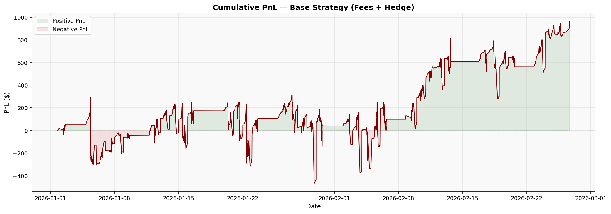
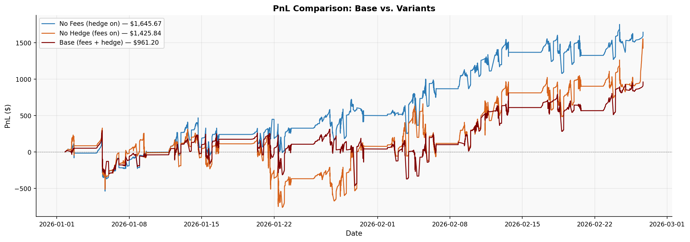
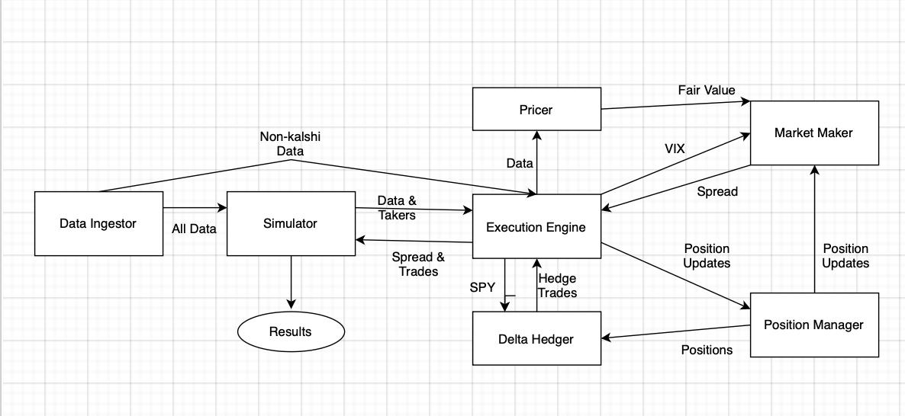

# Kalshi SPX Binary Contract Market Maker

A fully automated market-making system for Kalshi's short-dated SPX binary (event) contracts. Built as the final project for FINM 33150 — Quantitative Trading Strategies at the University of Chicago.

**Authors:** George Lord, Chris Mulligan, Max Zhalilo

---

## Results

38-day backtest on $10,000 initial capital (Jan–Feb 2026, SPX 6,797–6,979, VIX avg 17.6).

| Metric | Base (fees + hedge) | No Fees | No Hedge |
|---|---|---|---|
| Net PnL | **$961.20** | $1,645.67 | $1,425.84 |
| Period Return | **9.61%** | 16.46% | 14.26% |
| Sharpe Ratio | **6.14** | 10.00 | 7.22 |
| Sortino Ratio | **5.71** | 9.29 | 6.56 |
| Max Drawdown | **$778.56 (7.55%)** | $772.02 | $1,090.67 (10.56%) |
| Profitable Days | **25/38 (65.8%)** | — | — |

*Sharpe annualized from 1-second returns, r_f = 4.25% p.a. Mean absolute pricing error vs. VWAP: 7.1 cents.*

Key findings:
- **Fees are the primary drag**: Kalshi maker fees consumed 41.6% of gross earnings ($684.47)
- **Delta hedge reduces risk**: Max drawdown fell from 10.56% → 7.55%; VaR 95% improved ~30%
- **Alpha is structural**: SPX correlation of −0.19 (1s) confirms spread capture, not directional exposure
- **High-VIX sessions most profitable**: elevated uncertainty widens spreads while fill rate stays stable




---

## System Architecture



The system runs at 1Hz and is composed of five modules:

| Module | Description |
|---|---|
| `DataIngestor` | Loads and time-synchronizes SPX, VIX, SPY, and Kalshi tick data |
| `Pricer` | Values binary contracts using lognormal terminal distribution (BSM d2) with live VIX as implied vol |
| `MarketMaker` | Generates bid/ask quotes with dynamic spreads (base + VIX-dependent + inventory-dependent) |
| `DeltaHedger` | Aggregates portfolio delta across all Kalshi positions and hedges via SPY |
| `Simulator` | Last-in-queue fill model; logs full tick-by-tick behavior to parquet |

### Pricing

Binary contracts are priced as:

```
P(S_T > K) = Φ(d₂)     where d₂ = [ln(S/K) + (r − σ²/2)τ] / (σ√τ)
```

Range contracts (KXINX, 25-point buckets) are replicated as call spreads. Volatility is sourced from VIX/100 in real time.

### Spread Design

```
spread = base (2¢) + 0.1 × (VIX/100) + 0.025% × |inventory|
```

Outside market hours (9:30–16:00 ET), spreads widen by an additional 10 ticks.

---

## Tech Stack

- **Python 3.10+**
- [`polars`](https://pola.rs/) — fast DataFrame operations throughout
- `numpy` — numerical pricing (CDF, log/exp)
- `matplotlib` — visualization
- `pyarrow` — parquet I/O
- `blpapi` / `yfinance` — Bloomberg or Yahoo Finance for SPX/VIX data (see below)
- `requests`, `cryptography` — Kalshi API connectivity

---

## Running the Simulator

### Install dependencies

```bash
pip install -r requirements.txt
```

`blpapi` (Bloomberg) and `yfinance` require separate installation — see comments in `Data/pull_spx_bbg.py`.

### Data

The simulator expects cleaned parquet files for SPX, VIX, SPY, and Kalshi order book data. These are not included in this repo due to data licensing (Bloomberg, Databento). See `src/DataIngestor.py` for the expected schema and `Data/pull_spx_bbg.py` for the Bloomberg extraction script.

### Run

```bash
python main.py \
  --spx   "Data/cleaned_parquets/spx_clean.parquet" \
  --vix   "Data/cleaned_parquets/vix_clean.parquet" \
  --spy   "Data/cleaned_parquets/spy_clean.parquet" \
  --kalshi-clean "Data/cleaned_parquets/kalshi_kxinx_clean.parquet" \
  --kalshi-clean "Data/cleaned_parquets/kalshi_kxinxu_clean.parquet" \
  --output "simulation_output.parquet" \
  --out-of-market-spread-ticks 10
```

**Ablation flags:**

```bash
--no-fees     # disable Kalshi maker fees
--no-hedge    # disable SPY delta hedge
```

---

## Repository Structure

```
src/
  DataIngestor.py      # market data loader
  Pricer.py            # binary option fair value calculator
  MarketMaker.py       # quoting engine (spread + inventory model)
  ExecutionEngine.py   # central orchestration and position management
  DeltaHedger.py       # SPY delta hedging
  PositionManager.py   # trade execution and position tracking
  Simulator.py         # market simulation with fill detection
Data/
  architecture.jpg     # system diagram
  pull_spx_bbg.py      # Bloomberg data extraction script
pitchbook_figs/        # performance charts
paper_functions.py     # analysis and plotting utilities
main.py                # CLI entry point
submission.ipynb       # full analysis notebook
QTS_Pitchbook_Final.pdf  # final presentation
```

---

## References

- C. Bürgi, W. Deng, and K. Whelan, "Makers and Takers: The Economics of the Kalshi Prediction Market," 2025. [doi:10.2139/ssrn.5502658](https://doi.org/10.2139/ssrn.5502658)
- J. E. Ingersoll Jr., "Digital Contracts: Simple Tools for Pricing Complex Derivatives," *The Journal of Business*, vol. 73, no. 1, pp. 67–88, 2000. [doi:10.1086/209632](https://doi.org/10.1086/209632)